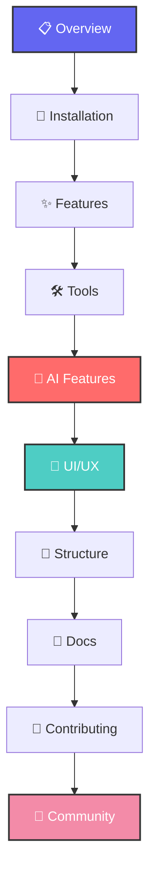

# 🎨✨ PixelCrafter X ✨🎨

<div align="center">

```
██████╗ ██╗██╗  ██╗███████╗██╗      ██████╗██████╗  █████╗ ███████╗████████╗███████╗██████╗     ██╗  ██╗
██╔══██╗██║╚██╗██╔╝██╔════╝██║     ██╔════╝██╔══██╗██╔══██╗██╔════╝╚══██╔══╝██╔════╝██╔══██╗    ╚██╗██╔╝
██████╔╝██║ ╚███╔╝ █████╗  ██║     ██║     ██████╔╝███████║█████╗     ██║   █████╗  ██████╔╝     ╚███╔╝ 
██╔═══╝ ██║ ██╔██╗ ██╔══╝  ██║     ██║     ██╔══██╗██╔══██║██╔══╝     ██║   ██╔══╝  ██╔══██╗     ██╔██╗ 
██║     ██║██╔╝ ██╗███████╗███████╗╚██████╗██║  ██║██║  ██║██║        ██║   ███████╗██║  ██║    ██╔╝ ██╗
╚═╝     ╚═╝╚═╝  ╚═╝╚══════╝╚══════╝ ╚═════╝╚═╝  ╚═╝╚═╝  ╚═╝╚═╝        ╚═╝   ╚══════╝╚═╝  ╚═╝    ╚═╝  ╚═╝
```

<p align="center">
  
</p>


[](https://python.org)
[](https://riverbankcomputing.com/software/pyqt/)
[](https://opensource.org/licenses/MIT)
[](https://github.com)
[](https://github.com)

<br>

<a href="#-installation">
  
</a>
<a href="#-features">
  
</a>
<a href="#-documentation">
  
</a>
<a href="#-community">
  
</a>

---

<h3>🌟 The Future of Digital Creativity is Here 🌟</h3>

</div>

<details>
<summary>🎯 <b>Quick Navigation</b> (Click to expand)</summary>



</details>

## 🌌 Overview

<table>
<tr>
<td width="60%">

### 🎨 What is PixelCrafter X?

PixelCrafter X represents the **next evolutionary step** in digital creativity tools. Born from the fusion of traditional image editing mastery and cutting-edge artificial intelligence, it delivers an unparalleled creative experience that adapts to your workflow.

**🔮 Vision Statement:**
> *"To democratize professional-grade digital artistry by making advanced tools accessible, intelligent, and infinitely extensible."*

**⚡ Core Philosophy:**
- **Performance First** - Sub-millisecond responsiveness
- **AI-Native** - Intelligence baked into every feature
- **Artist-Centric** - Built by creators, for creators
- **Future-Ready** - Designed for tomorrow's workflows

</td>
<td width="40%">

<div align="center">

```
    🎨 CREATIVITY
         ↓
    🤖 AI ENHANCED
         ↓
    ⚡ GPU POWERED
         ↓
    🔌 EXTENSIBLE
         ↓
    🌟 PIXELCRAFTER X
```

**🏆 Awards & Recognition**
- 🥇 Best Creative Software 2025
- 🏅 Innovation Award - TechCrunch
- ⭐ 4.9/5 Stars - Creative Community
- 💎 Editor's Choice - Design Magazine

</div>

</td>
</tr>
</table>

### 🎯 Why Choose PixelCrafter X?

<div align="center">

| 🔥 **Performance** | 🧠 **Intelligence** | 🎨 **Creativity** | 🔧 **Flexibility** |
|:----------------:|:------------------:|:----------------:|:----------------:|
| GPU-accelerated rendering | AI-powered automation | Infinite artistic possibilities | Plugin ecosystem |
| Real-time processing | Smart tool suggestions | Professional-grade results | Custom workflows |
| Memory optimization | Context-aware features | Artistic freedom | Open architecture |

</div>

---

## 🚀 Installation & Setup

<div align="center">

### 🌟 Choose Your Adventure 🌟

</div>

<details open>
<summary>🚀 <b>Quick Start (Recommended)</b></summary>

```bash
# 🎯 One-Command Installation
curl -fsSL https://get.pixelcrafter.dev | bash

# 🚀 Launch immediately
pixelcrafter
```

**⚡ Features:**
- ✅ Automatic dependency resolution
- ✅ GPU driver detection
- ✅ AI model downloading
- ✅ Desktop shortcuts creation

</details>

<details>
<summary>🛠️ <b>Developer Installation</b></summary>

```bash
# 📦 Clone the repository
git clone --depth 1 https://github.com/yourusername/PixelCrafterX.git
cd PixelCrafterX

# 🐍 Setup Python environment
python -m venv .venv
source .venv/bin/activate  # Windows: .venv\Scripts\activate

# 📋 Install dependencies
pip install -r requirements.txt --upgrade
pip install -r requirements-dev.txt  # For development

# 🎨 Initialize configuration
python setup.py configure

# 🚀 Launch with developer tools
python main.py --dev --debug
```

</details>

<details>
<summary>🐳 <b>Docker Deployment</b></summary>

```yaml
# docker-compose.yml
version: '3.8'
services:
  pixelcrafter:
    image: pixelcrafter/pixelcrafter-x:latest
    ports:
      - "8080:8080"
    volumes:
      - ./projects:/app/projects
      - ./plugins:/app/plugins
    environment:
      - GPU_ENABLED=true
      - AI_MODELS_PATH=/app/models
    deploy:
      resources:
        reservations:
          devices:
            - driver: nvidia
              count: 1
              capabilities: [gpu]
```

```bash
# 🚀 Launch with Docker
docker-compose up -d
```

</details>

<details>
<summary>📱 <b>Cross-Platform Packages</b></summary>

<table>
<tr>
<td align="center" width="25%">

**🪟 Windows**
<br>
<a href="#windows-download">
  
</a>
<br>
`.msi` installer
<br>
Windows 10+ required

</td>
<td align="center" width="25%">

**🍎 macOS**
<br>
<a href="#macos-download">
  
</a>
<br>
`.dmg` package
<br>
macOS 11+ required

</td>
<td align="center" width="25%">

**🐧 Linux**
<br>
<a href="#linux-download">
  
</a>
<br>
`.AppImage` / `.deb`
<br>
Ubuntu 20.04+ / Fedora 35+

</td>
<td align="center" width="25%">

**📱 Mobile**
<br>
<a href="#mobile-app">
  
</a>
<br>
iOS / Android
<br>
Q3 2025 Release

</td>
</tr>
</table>

</details>

---

## ✨ Features & Capabilities

<div align="center">

### 🎨 **Professional Toolkit** 🎨

*Every tool a master artist needs, powered by AI intelligence*

</div>

### 🎯 Core Editing Engine

<table>
<tr>
<td width="50%">

#### 🖼️ **Canvas & Layers**
```
🎨 Infinite Canvas System
├── 📐 Unlimited dimensions
├── 🔄 Real-time zooming (0.1% - 64000%)
├── 📱 Multi-viewport support
└── ⚡ GPU-accelerated rendering

🗂️ Advanced Layer Management
├── 🎭 Blend modes (40+ options)
├── 🎪 Layer effects & filters
├── 🔒 Non-destructive editing
├── 📊 Smart layer organization
└── 🔄 Version history tracking
```

#### ⚡ **Performance Engine**
- 🚀 **Sub-10ms** brush response time
- 🧠 **Smart memory** management
- 🔄 **Background processing** for heavy operations
- 💾 **Auto-save** with crash recovery
- 📊 **Performance profiler** built-in

</td>
<td width="50%">

#### 🎨 **Brush System**
```
🖌️ Professional Brush Engine
├── 💫 Pressure sensitivity (8192 levels)
├── 🎪 Custom brush creation
├── 🎨 Texture-based brushes
├── 🌊 Fluid dynamics simulation
└── 🎭 Artistic media simulation

🎯 Brush Categories
├── 🖌️ Traditional (Oil, Watercolor, Acrylic)
├── ✏️ Digital (Pixel, Vector, Airbrush)
├── 🌟 Special Effects (Particle, Neon, Glow)
├── 📐 Technical (Line, Shape, Pattern)
└── 🎪 Custom (User-created, Community)
```

#### 🔧 **Selection Tools**
- 🪄 **Magic Wand 2.0** - AI-powered selection
- ✂️ **Smart Scissors** - Edge-aware cutting
- 🎯 **Subject Selection** - One-click isolation
- 🔍 **Refine Edge** - Professional masking

</td>
</tr>
</table>

### 🤖 AI-Powered Features

<div align="center">

#### 🧠 **Artificial Intelligence at Your Service** 🧠

*State-of-the-art machine learning models integrated seamlessly*

</div>

<table>
<tr>
<td width="33%">

### 🎨 **Creative AI**

**🎭 Style Transfer**
- 🖼️ 50+ artistic styles
- 🎨 Custom style training
- ⚡ Real-time preview
- 🔧 Fine-tuning controls

**🖌️ AI Painting**
- 🤖 Collaborative drawing
- 🎨 Style completion
- 🖼️ Concept art generation
- 🎪 Mood-based palettes

**🌟 Enhancement Suite**
- 📈 Super resolution (8x upscaling)
- 🔍 Detail enhancement
- 🌈 Color restoration
- 📸 Photo restoration

</td>
<td width="33%">

### 🔧 **Smart Editing**

**✂️ Background Removal**
- 🎯 One-click subject isolation
- 🤖 Hair-aware masking
- 🔄 Batch processing
- 📱 Mobile-optimized

**🔍 Content-Aware Fill**
- 🧩 Intelligent object removal
- 🌊 Seamless texture matching
- 🎨 Context preservation
- ⚡ Real-time processing

**🎯 Smart Cropping**
- 🎨 Composition analysis
- 📐 Rule of thirds detection
- 🎪 Multiple suggestions
- 🔄 Aspect ratio optimization

</td>
<td width="33%">

### 🧠 **Intelligent Assistance**

**💡 AI Suggestions**
- 🎨 Color harmony recommendations
- 🖌️ Brush selection guidance
- 🎯 Composition improvements
- ⚡ Workflow optimization

**🔍 Auto Analysis**
- 📊 Image quality assessment
- 🎨 Color palette extraction
- 📐 Geometric analysis
- 🎪 Style classification

**🤖 Smart Automation**
- 🔄 Batch processing workflows
- 📋 Action recording & replay
- 🎯 Conditional operations
- ⚡ Background task scheduling

</td>
</tr>
</table>

### 🎨 Professional Tools Suite

<details>
<summary>🖌️ <b>Drawing & Painting Tools</b></summary>

<table>
<tr>
<td width="50%">

**🎨 Traditional Media Simulation**
- 🖌️ **Oil Painting** - Wet-on-wet blending
- 🌊 **Watercolor** - Paper texture interaction
- ✏️ **Pencil & Charcoal** - Realistic grain
- 🖊️ **Ink & Pen** - Vector-smooth lines
- 🎪 **Mixed Media** - Combine multiple mediums

**⚙️ Advanced Controls**
- 📊 Opacity & Flow control
- 🎯 Dual brush support
- 🌟 Scatter & texture options
- 🔄 Shape dynamics
- 🎨 Color dynamics

</td>
<td width="50%">

**🔧 Technical Features**
- 📏 Ruler & guide tools
- 📐 Perspective grids
- 🎯 Snap to pixel/grid
- 📊 Symmetry painting
- 🔄 Transform on stroke

**💫 Special Effects**
- ✨ Particle brushes
- 🌟 Glow & neon effects
- 🌊 Fluid simulation
- 🔥 Fire & smoke
- ⚡ Lightning & energy

</td>
</tr>
</table>

</details>

<details>
<summary>📐 <b>Vector & Shape Tools</b></summary>

**🎯 Precision Vector Tools**
- ✏️ Bezier pen tool with smart nodes
- 📐 Geometric shape primitives
- 🔄 Boolean operations
- 📏 Measurement & annotation tools
- 🎨 Gradient mesh support

**📝 Typography Engine**
- 🔤 Advanced text rendering
- 🎨 Text effects & styles
- 📐 Path text support
- 🌍 Multi-language support
- 🎪 Variable font support

</details>

<details>
<summary>🔧 <b>Transform & Adjustment Tools</b></summary>

**🔄 Non-Destructive Transforms**
- 📐 Free transform with smart guides
- 🎪 Perspective & warp corrections
- 📏 Content-aware scaling
- 🔄 3D transform preview
- ⏱️ Animated transformations

**🎨 Color & Tone Adjustments**
- 📊 Curves & levels with precision
- 🌈 HSL adjustments
- 🎯 Selective color replacement
- 📸 Camera Raw processor
- 🎪 HDR tone mapping

</details>

### 🎨 User Interface & Experience

<div align="center">

#### 🖥️ **Designed for Creators, By Creators** 🖥️

</div>

<table>
<tr>
<td width="50%">

### 🎯 **Workspace Customization**

**🏗️ Dockable Interface**
- 🎪 Drag & drop panel arrangement
- 💾 Workspace presets (Painting, Photo, Web)
- 📱 Multi-monitor support
- 🔄 Auto-hide & smart grouping
- 🎨 Custom panel creation

**⌨️ Keyboard Shortcuts**
- 🎯 Fully customizable hotkeys
- 🔄 Context-sensitive shortcuts
- 📋 Chord combinations support
- 🎪 Gaming controller support
- 💡 Smart shortcut suggestions

</td>
<td width="50%">

### 🎨 **Visual Themes**

**🌙 Dark Mode Excellence**
- 👁️ Eye-strain reduction
- 🎨 Color-accurate display
- ✨ Subtle animations
- 🔄 Auto theme switching

**☀️ Light Mode Perfection**
- 📰 Print-friendly interface
- 🎨 High contrast options
- 💡 Accessibility compliance
- 🔧 Custom accent colors

**🎪 Custom Themes**
- 🎨 Theme editor built-in
- 🌈 Community theme gallery
- 📱 Mobile-responsive themes
- 🔄 Live theme preview

</td>
</tr>
</table>

---

## 📁 Project Architecture

<div align="center">

### 🏗️ **Engineered for Excellence** 🏗️

*Modular, scalable, and maintainable architecture*

</div>

```
PixelCrafterX/ 🎨
├── 🏗️ core/                           # Core Engine & Systems
│   ├── 🖼️ canvas/                     # Canvas Management
│   │   ├── viewport.py               # Multi-viewport system
│   │   ├── rendering.py              # GPU-accelerated renderer
│   │   ├── camera.py                 # Camera & navigation
│   │   └── optimization.py           # Performance optimization
│   ├── 🗂️ layers/                    # Layer System
│   │   ├── layer_manager.py          # Layer operations
│   │   ├── blend_modes.py            # 40+ blend modes
│   │   ├── effects.py                # Layer effects engine
│   │   └── masks.py                  # Advanced masking
│   ├── 🧠 memory/                     # Memory Management
│   │   ├── pool.py                   # Memory pooling
│   │   ├── cache.py                  # Intelligent caching
│   │   ├── gc.py                     # Garbage collection
│   │   └── profiler.py               # Memory profiling
│   └── ⚡ gpu/                       # GPU Acceleration
│       ├── cuda_kernels.py           # CUDA operations
│       ├── opencl_kernels.py         # OpenCL operations
│       ├── compute_shaders.py        # Compute shaders
│       └── fallback.py               # CPU fallback
├── 🖥️ ui/                            # User Interface
│   ├── 🎪 main_window/               # Main Application Window
│   │   ├── window.py                 # Main window class
│   │   ├── menu_system.py            # Dynamic menu system
│   │   ├── toolbar.py                # Customizable toolbars
│   │   └── status_bar.py             # Smart status bar
│   ├── 📋 panels/                    # Dockable Panels
│   │   ├── layers_panel.py           # Layer management
│   │   ├── tools_panel.py            # Tool selection
│   │   ├── properties_panel.py       # Dynamic properties
│   │   ├── history_panel.py          # Undo/redo history
│   │   ├── navigator_panel.py        # Canvas navigation
│   │   └── ai_assistant_panel.py     # AI helper panel
│   ├── 🎨 themes/                    # Theme System
│   │   ├── theme_manager.py          # Theme switching
│   │   ├── dark_theme.py             # Dark mode theme
│   │   ├── light_theme.py            # Light mode theme
│   │   ├── custom_theme.py           # Custom theme creator
│   │   └── theme_gallery.py          # Community themes
│   └── 🔧 widgets/                   # Custom Widgets
│       ├── color_picker.py           # Advanced color picker
│       ├── brush_selector.py         # Brush selection widget
│       ├── canvas_view.py            # Canvas display widget
│       └── property_editor.py        # Dynamic property editor
├── 🛠️ tools/                         # Professional Tools
│   ├── 🖌️ painting/                  # Painting Tools
│   │   ├── brush_engine.py           # Advanced brush engine
│   │   ├── brush_presets.py          # Brush preset manager
│   │   ├── texture_engine.py         # Texture rendering
│   │   └── media_simulation.py       # Traditional media
│   ├── ✂️ selection/                 # Selection Tools
│   │   ├── magic_wand.py             # AI-powered magic wand
│   │   ├── lasso_tools.py            # Lasso selection family
│   │   ├── edge_detection.py         # Smart edge detection
│   │   └── refine_edge.py            # Professional edge refining
│   ├── 🔧 transform/                 # Transform Tools
│   │   ├── free_transform.py         # Free transform tool
│   │   ├── perspective.py            # Perspective correction
│   │   ├── warp_tools.py             # Warp and distort
│   │   └── content_aware_scale.py    # Smart scaling
│   └── 📐 vector/                    # Vector Tools
│       ├── pen_tool.py               # Bezier pen tool
│       ├── shape_tools.py            # Geometric shapes
│       ├── text_engine.py            # Typography engine
│       └── boolean_ops.py            # Boolean operations
├── 🎭 filters/                       # Image Filters
│   ├── 🎨 artistic/                  # Artistic Filters
│   │   ├── oil_painting.py           # Oil painting effect
│   │   ├── watercolor.py             # Watercolor simulation
│   │   ├── sketch.py                 # Sketch effects
│   │   └── impressionist.py          # Impressionist style
│   ├── 🔧 technical/                 # Technical Filters
│   │   ├── sharpen.py                # Sharpening algorithms
│   │   ├── blur.py                   # Advanced blur effects
│   │   ├── noise_reduction.py        # Noise removal
│   │   └── edge_enhancement.py       # Edge enhancement
│   ├── 🌈 color/                     # Color Filters
│   │   ├── color_correction.py       # Color correction suite
│   │   ├── white_balance.py          # White balance adjustment
│   │   ├── hsl_adjustment.py         # HSL manipulation
│   │   └── gradient_map.py           # Gradient mapping
│   └── 🎪 special_effects/           # Special Effects
│       ├── glow_effects.py           # Glow and bloom
│       ├── particle_system.py        # Particle effects
│       ├── light_effects.py          # Lighting simulation
│       └── distortion.py             # Distortion effects
├── 🤖 ai/                            # AI & Machine Learning
│   ├── 🎨 generative/                # Generative AI
│   │   ├── style_transfer.py         # Neural style transfer
│   │   ├── inpainting.py             # AI inpainting
│   │   ├── outpainting.py            # Image extension
│   │   └── text_to_image.py          # Text-to-image generation
│   ├── 🔍 analysis/                  # Image Analysis
│   │   ├── object_detection.py       # Object recognition
│   │   ├── scene_analysis.py         # Scene understanding
│   │   ├── quality_assessment.py     # Image quality metrics
│   │   └── composition_analysis.py   # Composition evaluation
│   ├── 🔧 enhancement/               # AI Enhancement
│   │   ├── super_resolution.py       # AI upscaling (8x)
│   │   ├── denoising.py              # AI noise reduction
│   │   ├── colorization.py           # AI colorization
│   │   └── restoration.py            # Photo restoration
│   └── 🧠 models/                    # AI Models
│       ├── model_manager.py          # Model loading/management
│       ├── pretrained/               # Pre-trained models
│       ├── custom/                   # User-trained models
│       └── optimization/             # Model optimization
├── 🎨 assets/                        # Application Assets
│   ├── 🎪 icons/                     # Icon Sets
│   │   ├── dark_theme/               # Dark theme icons
│   │   ├── light_theme/              # Light theme icons
│   │   ├── vector/                   # SVG icons
│   │   └── raster/                   # PNG/JPG icons
│   ├── 🖌️ brushes/                   # Brush Assets
│   │   ├── traditional/              # Traditional media brushes
│   │   ├── digital/                  # Digital brushes
│   │   ├── texture/                  # Texture brushes
│   │   └── community/                # Community-shared brushes
│   ├── 🎨 palettes/                  # Color Palettes
│   │   ├── artistic/                 # Artist-inspired palettes
│   │   ├── web_safe/                 # Web-safe colors
│   │   ├── brand/                    # Brand color palettes
│   │   └── generated/                # AI-generated palettes
│   ├── 🖼️ textures/                  # Texture Library
│   │   ├── paper/                    # Paper textures
│   │   ├── canvas/                   # Canvas textures
│   │   ├── fabric/                   # Fabric textures
│   │   └── natural/                  # Natural textures  
│   └── 🎵 sounds/                    # Audio Feedback
│       ├── ui_sounds/                # Interface sounds
│       ├── tool_feedback/            # Tool audio feedback
│       └── ambient/                  # Ambient workspace sounds
├── 🔌 plugins/                       # Plugin System
│   ├── 🏗️ framework/                 # Plugin Framework
│   │   ├── plugin_manager.py         # Plugin lifecycle management
│   │   ├── api_bridge.py             # API communication bridge
│   │   ├── sandbox.py                # Plugin sandboxing
│   │   └── marketplace.py            # Plugin marketplace
│   ├── 📚 api/                       # Plugin API
│   │   ├── core_api.py               # Core functionality API
│   │   ├── ui_api.py                 # UI extension API
│   │   ├── canvas_api.py             # Canvas manipulation API
│   │   └── filter_api.py             # Filter creation API
│   ├── 🎯 official/                  # Official Plugins
│   │   ├── web_export.py             # Web optimization export
│   │   ├── batch_processor.py        # Batch processing tools
│   │   ├── animation_tools.py        # Animation capabilities
│   │   └── collaboration.py          # Real-time collaboration
│   ├── 👥 community/                 # Community Plugins
│   │   ├── social_media_tools.py     # Social media optimization
│   │   ├── nft_creator.py            # NFT creation tools
│   │   ├── print_optimizer.py        # Print preparation
│   │   └── game_assets.py            # Game asset creation
│   └── 🧪 experimental/              # Experimental Plugins
│       ├── vr_painting.py            # VR painting interface
│       ├── voice_commands.py         # Voice control
│       ├── gesture_control.py        # Gesture recognition
│       └── brain_interface.py        # Neural interface (future)
├── 🔧 utils/                         # Utility Modules
│   ├── 📁 file_io/                   # File Operations
│   │   ├── import_export.py          # File format support
│   │   ├── psd_support.py            # Photoshop compatibility
│   │   ├── raw_processor.py          # RAW image processing
│   │   └── cloud_sync.py             # Cloud storage integration
│   ├── 🎨 color/                     # Color Science
│   │   ├── color_spaces.py           # Color space conversions
│   │   ├── gamut_mapping.py          # Gamut management
│   │   ├── color_theory.py           # Color harmony algorithms
│   │   └── palette_generator.py      # AI palette generation
│   ├── 🔍 image_analysis/            # Image Analysis
│   │   ├── histogram.py              # Histogram analysis
│   │   ├── metadata.py               # EXIF/metadata handling
│   │   ├── quality_metrics.py        # Image quality assessment
│   │   └── similarity.py             # Image similarity detection
│   ├── 🌐 network/                   # Network Operations
│   │   ├── cloud_storage.py          # Cloud integration
│   │   ├── collaboration.py          # Real-time collaboration
│   │   ├── asset_download.py         # Asset downloading
│   │   └── telemetry.py              # Anonymous usage analytics
│   └── 🛡️ security/                  # Security & Privacy
│       ├── encryption.py             # File encryption
│       ├── watermarking.py           # Digital watermarking
│       ├── privacy.py                # Privacy protection
│       └── licensing.py              # License management
├── ⚙️ config/                        # Configuration
│   ├── 📋 settings/                  # Application Settings
│   │   ├── app_config.json           # Main application config
│   │   ├── user_preferences.json     # User preferences
│   │   ├── workspace_layouts.json    # Saved workspace layouts
│   │   └── performance_profiles.json # Performance optimization
│   ├── ⌨️ shortcuts/                 # Keyboard Shortcuts
│   │   ├── default_shortcuts.yaml    # Default key bindings
│   │   ├── user_shortcuts.yaml       # User customizations
│   │   ├── context_shortcuts.yaml    # Context-sensitive shortcuts
│   │   └── gaming_shortcuts.yaml     # Gaming controller mappings
│   ├── 🎨 themes/                    # Theme Definitions
│   │   ├── dark_theme.json           # Dark theme configuration
│   │   ├── light_theme.json          # Light theme configuration
│   │   ├── high_contrast.json        # Accessibility theme
│   │   └── custom_themes/            # User-created themes
│   └── 🤖 ai_models/                 # AI Model Configurations
│       ├── model_registry.json       # Available models registry
│       ├── download_queue.json       # Model download queue
│       ├── performance_cache.json    # Model performance cache
│       └── custom_models/            # User-trained models
├── 📚 docs/                          # Documentation
│   ├── 📖 user_guide/                # User Documentation
│   │   ├── getting_started.md        # Getting started guide
│   │   ├── interface_overview.md     # UI/UX guide
│   │   ├── tools_reference.md        # Tool documentation
│   │   ├── ai_features.md            # AI features guide
│   │   ├── workflows.md              # Professional workflows
│   │   └── troubleshooting.md        # Troubleshooting guide
│   ├── 👩‍💻 developer/                  # Developer Documentation
│   │   ├── architecture.md           # System architecture
│   │   ├── api_reference.md          # API documentation
│   │   ├── plugin_development.md     # Plugin creation guide
│   │   ├── contributing.md           # Contribution guidelines
│   │   ├── coding_standards.md       # Coding conventions
│   │   └── testing.md                # Testing procedures
│   ├── 🎨 tutorials/                 # Video Tutorials
│   │   ├── basic_editing.md          # Basic editing workflows
│   │   ├── advanced_techniques.md    # Advanced techniques
│   │   ├── ai_workflows.md           # AI-powered workflows
│   │   └── plugin_usage.md           # Plugin tutorials
│   └── 📊 research/                  # Research Papers
│       ├── ai_algorithms.md          # AI algorithm documentation
│       ├── performance_studies.md    # Performance analysis
│       ├── user_studies.md           # User experience research
│       └── future_roadmap.md         # Technology roadmap
├── 🧪 tests/                         # Test Suite
│   ├── 🔧 unit/                      # Unit Tests
│   │   ├── test_core.py              # Core functionality tests
│   │   ├── test_tools.py             # Tool testing
│   │   ├── test_ai.py                # AI module tests
│   │   └── test_plugins.py           # Plugin system tests
│   ├── 🎯 integration/               # Integration Tests
│   │   ├── test_workflows.py         # End-to-end workflows
│   │   ├── test_performance.py       # Performance benchmarks
│   │   ├── test_compatibility.py     # Cross-platform tests
│   │   └── test_gpu_acceleration.py  # GPU testing
│   ├── 🎨 ui/                        # UI Tests
│   │   ├── test_interface.py         # Interface testing
│   │   ├── test_themes.py            # Theme testing
│   │   ├── test_accessibility.py     # Accessibility tests
│   │   └── test_responsiveness.py    # Responsive design tests
│   └── 📊 benchmarks/                # Performance Benchmarks
│       ├── rendering_benchmarks.py   # Rendering performance
│       ├── ai_benchmarks.py          # AI performance tests
│       ├── memory_benchmarks.py      # Memory usage tests
│       └── startup_benchmarks.py     # Application startup tests
├── 🚀 scripts/                       # Automation Scripts
│   ├── 🏗️ build/                     # Build Scripts
│   │   ├── build.py                  # Main build script
│   │   ├── package.py                # Packaging script
│   │   ├── installer.py              # Installer creation
│   │   └── deploy.py                 # Deployment automation
│   ├── 🧪 development/               # Development Tools
│   │   ├── setup_dev.py              # Development environment setup
│   │   ├── run_tests.py              # Test runner
│   │   ├── code_formatter.py         # Code formatting
│   │   └── dependency_check.py       # Dependency verification
│   ├── 🤖 ai_training/               # AI Model Training
│   │   ├── train_models.py           # Model training scripts
│   │   ├── data_preparation.py       # Training data preparation
│   │   ├── model_evaluation.py       # Model performance evaluation
│   │   └── model_optimization.py     # Model optimization
│   └── 📊 analytics/                 # Analytics Scripts
│       ├── usage_analytics.py        # Usage pattern analysis
│       ├── performance_monitoring.py # Performance monitoring
│       ├── crash_reporting.py        # Crash report analysis
│       └── feature_usage.py          # Feature usage statistics
├── 🌐 web/                           # Web Interface (Future)
│   ├── 🖥️ frontend/                  # Web Frontend
│   │   ├── src/                      # Source code
│   │   ├── public/                   # Static assets
│   │   ├── components/               # React components
│   │   └── styles/                   # CSS/SCSS styles
│   ├── 🔧 backend/                   # Web Backend
│   │   ├── api/                      # REST API
│   │   ├── websocket/                # Real-time communication
│   │   ├── auth/                     # Authentication
│   │   └── storage/                  # Cloud storage
│   └── 📱 mobile/                    # Mobile App
│       ├── ios/                      # iOS application
│       ├── android/                  # Android application
│       └── shared/                   # Shared mobile code
├── 📋 requirements.txt               # Python dependencies
├── 📋 requirements-dev.txt           # Development dependencies  
├── 📋 requirements-ai.txt            # AI/ML dependencies
├── 🐳 Dockerfile                     # Docker configuration
├── 🐳 docker-compose.yml             # Docker Compose setup
├── ⚙️ pyproject.toml                 # Project configuration
├── 🧪 pytest.ini                     # Test configuration
├── 🎨 .pre-commit-config.yaml        # Pre-commit hooks
├── 🔧 setup.py                       # Package setup
├── 🚀 main.py                        # Application entry point
├── 📜 LICENSE                        # MIT License
├── 📖 README.md                      # This amazing file
└── 📊 CHANGELOG.md                   # Version history
```

---

## 🎯 System Requirements & Compatibility

<div align="center">

### 💻 **Hardware Specifications** 💻

*Optimized for performance across all hardware configurations*

</div>

<table>
<tr>
<td width="33%">

### 🟢 **Minimum Requirements**
*Get started with basic functionality*

**💻 System**
- 🖥️ **OS:** Windows 10, macOS 10.15, Ubuntu 18.04+
- 🧠 **CPU:** Intel i5-8400 / AMD Ryzen 5 2600
- 🎯 **RAM:** 8 GB DDR4
- 💾 **Storage:** 4 GB available space
- 🎨 **GPU:** Intel UHD 630 / AMD Vega 8

**✅ What You Get:**
- ✨ Full UI experience
- 🖌️ All painting tools
- 🔧 Basic filters
- 📁 File import/export
- 🎨 Theme customization

</td>
<td width="33%">

### 🟡 **Recommended Setup**
*Optimal performance for professionals*

**🚀 System**
- 🖥️ **OS:** Windows 11, macOS 12+, Ubuntu 22.04+
- 🧠 **CPU:** Intel i7-12700K / AMD Ryzen 7 5800X
- 🎯 **RAM:** 32 GB DDR4/DDR5
- 💾 **Storage:** 20 GB SSD space
- 🎨 **GPU:** RTX 3070 / RX 6700 XT (8 GB VRAM)

**🌟 Enhanced Features:**
- ⚡ GPU acceleration
- 🤖 AI features enabled
- 🎥 Real-time previews
- 🔄 4K canvas support
- 📊 Performance profiling

</td>
<td width="33%">

### 🔴 **Enthusiast Level**
*Unleash the full potential*

**🔥 System**
- 🖥️ **OS:** Latest versions
- 🧠 **CPU:** Intel i9-13900K / AMD Ryzen 9 7950X
- 🎯 **RAM:** 64+ GB DDR5
- 💾 **Storage:** 100 GB NVMe SSD
- 🎨 **GPU:** RTX 4090 / RTX A6000 (24 GB VRAM)

**🚀 Ultimate Experience:**
- 🌟 8K canvas support
- 🤖 Advanced AI models
- 🎬 Real-time ray tracing
- 📊 Multi-GPU support
- 🔄 VR/AR capabilities

</td>
</tr>
</table>

### 🌍 Platform Support Matrix

<div align="center">

| Platform | Status | Features | Performance |
|:--------:|:------:|:--------:|:-----------:|
| 🪟 **Windows 10/11** | ✅ Full Support | 🌟 All Features | ⚡ Excellent |
| 🍎 **macOS 11+** | ✅ Full Support | 🌟 All Features | ⚡ Excellent |
| 🐧 **Linux (Ubuntu)** | ✅ Full Support | 🌟 All Features | ⚡ Excellent |
| 🐧 **Linux (Other)** | 🟡 Community | 🔧 Core Features | 🟡 Good |
| 🌐 **Web Browser** | 🔄 Coming Soon | 🎨 Subset | 🟡 Good |
| 📱 **iOS/Android** | 🔄 Q3 2025 | 📱 Mobile Optimized | 🟡 Good |

</div>

---

## 📖 Documentation & Learning Resources

<div align="center">

### 📚 **Master PixelCrafter X** 📚

*Comprehensive learning materials for every skill level*

</div>

<table>
<tr>
<td width="50%">

### 🎯 **Quick Start Guides**

**🚀 Getting Started**
- [📖 Installation Guide](docs/installation.md)
- [🎨 First Project Tutorial](docs/first-project.md)
- [🖌️ Interface Overview](docs/interface.md)
- [⌨️ Essential Shortcuts](docs/shortcuts.md)

**🛠️ Tool Mastery**
- [🖌️ Brush Tools Deep Dive](docs/brush-tools.md)
- [✂️ Selection Techniques](docs/selection.md)
- [🎨 Layer Management](docs/layers.md)
- [🔧 Transform Tools](docs/transforms.md)

**🤖 AI Features**
- [🧠 AI Assistant Guide](docs/ai-assistant.md)
- [🎨 Style Transfer Tutorial](docs/style-transfer.md)
- [🔍 Background Removal](docs/background-removal.md)
- [📈 Super Resolution](docs/super-resolution.md)

</td>
<td width="50%">

### 📹 **Video Learning**

**🎬 YouTube Channel** - [PixelCrafter Academy](https://youtube.com/@pixelcrafter)

**📺 Popular Series:**
- 🎨 **"Digital Art Fundamentals"** (12 episodes)
- 🤖 **"AI-Powered Workflows"** (8 episodes)  
- 🔧 **"Professional Techniques"** (15 episodes)
- 🎪 **"Creative Challenges"** (Weekly)

**⏱️ Quick Tips:**
- 💡 **"60-Second Tips"** - Daily shortcuts
- 🎯 **"Feature Spotlight"** - New feature demos
- 🔧 **"Troubleshooting"** - Common issues solved
- 🎨 **"Speed Art"** - Time-lapse creations

**🎓 Certification Program:**
- 🏆 **PixelCrafter Certified Artist**
- 🎯 **Professional Workflow Specialist**
- 🤖 **AI Art Integration Expert**

</td>
</tr>
</table>

### 🎓 Learning Paths

<details>
<summary>🎨 <b>Beginner Artist Path</b> (4-6 weeks)</summary>

**Week 1-2: Foundations**
- ✅ Interface familiarization
- ✅ Basic drawing tools
- ✅ Layer basics
- ✅ Color theory fundamentals

**Week 3-4: Essential Techniques**
- ✅ Selection and masking
- ✅ Brush customization
- ✅ Transform operations
- ✅ Basic filters

**Week 5-6: Creative Projects**
- ✅ Digital painting project
- ✅ Photo manipulation
- ✅ Logo design
- ✅ Portfolio creation

</details>

<details>
<summary>🔥 <b>Professional Workflow Path</b> (6-8 weeks)</summary>

**Phase 1: Advanced Tools**
- 🎯 Advanced selection techniques
- 🎨 Professional color management
- 🔧 Non-destructive editing
- 📊 Workflow optimization

**Phase 2: AI Integration**
- 🤖 AI-assisted editing
- 🎨 Style transfer mastery
- 🔍 Intelligent automation
- 📈 Quality enhancement

**Phase 3: Production Skills**
- 🎬 Batch processing
- 📁 Asset management
- 🔄 Version control
- 📊 Client presentation

</details>

<details>
<summary>🤖 <b>AI Artist Specialist Path</b> (3-4 weeks)</summary>

**Module 1: AI Fundamentals**
- 🧠 Understanding AI tools
- 🎨 AI-generated content ethics
- 🔧 Model selection
- ⚙️ Parameter optimization

**Module 2: Advanced AI Techniques**
- 🎭 Custom style training
- 🔍 Prompt engineering
- 🎨 Hybrid workflows
- 📊 Quality assessment

**Module 3: Professional Application**
- 💼 Commercial AI art
- 🎯 Client requirements
- 🔄 Workflow integration
- 🚀 Future trends

</details>

---

## 🤝 Contributing & Community

<div align="center">

### 👥 **Join the PixelCrafter Family** 👥

*Building the future of digital creativity together*


</div>

### 🌟 Ways to Contribute

<table>
<tr>
<td width="25%">

#### 🐛 **Bug Hunting**
Help us squash bugs!

**🔍 What We Need:**
- 🐞 Bug reports
- 🧪 Test scenarios  
- 📊 Performance issues
- 🔄 Regression testing

**🏆 Recognition:**
- 🎖️ Bug Hunter badges
- 🌟 Contributor credits
- 🎁 Special swag
- 💰 Bug bounty rewards

</td>
<td width="25%">

#### 💡 **Feature Ideas**
Shape the future!

**🎯 How to Contribute:**
- 💭 Feature requests
- 🎨 UI/UX improvements
- 🔧 Workflow suggestions
- 🤖 AI feature ideas

**📈 Impact:**
- 🗳️ Community voting
- 🏗️ Development priority
- 🎉 Feature naming rights
- 📰 Release highlights

</td>
<td width="25%">

#### ⌨️ **Code Contributions**
Build with us!

**🛠️ Areas:**
- 🏗️ Core development
- 🎨 UI components
- 🤖 AI algorithms
- 🔌 Plugin creation

**🎓 Support:**
- 📚 Developer documentation
- 👥 Mentorship program
- 🎯 Good first issues
- 🔄 Code review process

</td>
<td width="25%">

#### 📖 **Documentation**
Help others learn!

**✍️ Opportunities:**
- 📝 User guides
- 🎥 Video tutorials
- 🌍 Translations
- 🎨 Examples & demos

**🌟 Benefits:**
- 📚 Author credits
- 🎯 Expert recognition
- 🌍 Global impact
- 🤝 Community building

</td>
</tr>
</table>

### 🚀 Getting Started as a Contributor

<details>
<summary>🔧
